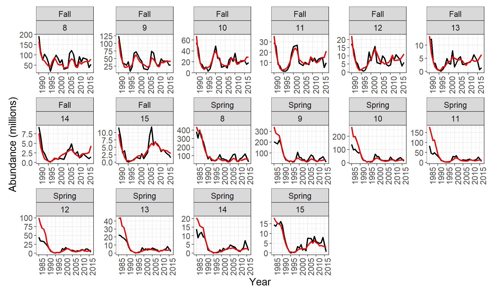

<!-- README.md is generated from README.Rmd. Please edit that file -->

# APAM: American plaice assessment model

<!-- badges: start -->
<!-- badges: end -->

APAM is an age-based state-space stock assessment model developed for
the American plaice stock on the Grand Bank of Newfoundland (NAFO
divisions 3LNO). The base formulation is described in [Perreault et al.,
2020](https://journal.nafo.int/dnn/Volumes/Articles/ID/654/A-state-space-stock-assessment-model-for-American-plaice-on-the-Grand-Bank-of-Newfoundland)
and can be run by following the steps below. We note that this model
formulation does not include data for the Spanish surveys due to
confidentiality issues. How to fit some model variations (e.g. parameter
map, M assumption) is also explained; see the function documentation and
[Perreault et al.,
2020](https://journal.nafo.int/dnn/Volumes/Articles/ID/654/A-state-space-stock-assessment-model-for-American-plaice-on-the-Grand-Bank-of-Newfoundland)
for additional details.

We also include details on how to run the M diagnostics from Perreault &
Cadigan (2021, in progress).

This is still a work in progress, and we aim to add other model
diagnostics (e.g. retros, self sims), additional plots and testing soon!

## Installation

The latest version can be installed via:

``` r
devtools::install_github("SineAndie/APAM", dependencies=TRUE)
```

## To run the base model

Running APAM consists of four steps:

1.  reading in the data,
2.  making the parameter map,
3.  defining parameters and
4.  model fitting.

Notes on how to modify inputs and model formulation are detailed in the
following section.

``` r
library(APAM)
```

``` r
#read in data and structure for use in APAM
tmb.data<-make.tmb.data()

#make parameter map 
pmap<-make.map(tmb.data)

#prepare parameters
params<-make.parm(tmb.data, pmap)

#Finally, fit the model! (note: takes approx. 10 mins to run)
fit<-make.fit(tmb.data, pmap, params)
```

Outputs can be viewed with the make.plot function. There are a variety
of plots available, and a few examples are shown below.

``` r
plots<-make.plots(fit)

#estimated population processes
plots$pop_process
```


``` r
#observed vs predicted survey indices ages 1-7
plots$index_fit1
```


``` r
#observed vs predicted survey indices ages 8-15
plots$index_fit2
```



``` r
#survey residuals
plots$resid_index
```


## Explore model variations

The natural mortality assumption, including M split for years 1989-1996,
can be changed within the make.tmb.data function. For example:

``` r
#turn off M split 
tmb.data_nosplit <- make.tmb.data(M.split = F) 

#change M assumption to 0.5 for all ages and years
M.matrix = matrix(0.5,nrow = tmb.data$Y, ncol = tmb.data$A)

tmb.data_newM <- make.tmb.data(M.matrix = M.matrix) 
```

Additionally, can turn process errors on/off through the make.map
function and make.parameters.

``` r
pmap2<-make.map(tmb.data,no.pe = TRUE)
params2<-make.parm(tmb.data, pmap2, no.pe = TRUE)

#Then fit the model like usual
fit2<-make.fit(tmb.data, pmap2, params2)

#check for convergence/output nll 
fit$opt$message
#> [1] "relative convergence (4)"
fit$obj$fn()
#> [1] 3515.087
#> attr(,"logarithm")
#> [1] TRUE

fit2$opt$message
#> [1] "relative convergence (4)"
fit2$obj$fn()
#> [1] 3727.348
#> attr(,"logarithm")
#> [1] TRUE
```

The parameter map can be manually changed via setmap (still needs a bit
of work/cleanup but in progress!)

``` r
##default formulation: 
#setmap <- list(
    #   meanF= c("5","6"),
    #   stdF = c("5",rep("6+",length =   tmb.data$A-5)),
    #   ageFall = c("1",rep("2-11",10),rep("12-15",4)),
    #   ageSpring = c("1","2",rep("3-13",11),rep("14-15",2)),
    #   ageSpanish = NULL,
    #   stdcrl  = c(rep("5-6",2),rep("7-11",5),rep("12-14",3)),
    #   stdpe = rep("all", tmb.data$A-1),
    #   mapq = c(1:7,rep(NA,length = (tmb.data$A-1)-7))
    # )

#change to one meanF parameter and one std F parameter
setmap <- list(
  meanF= c("6"),
  stdF = c(rep("5+",length =   tmb.data$A-4)),
  ageFall = c("1",rep("2-11",10),rep("12-15",4)),
  ageSpring = c("1","2",rep("3-13",11),rep("14-15",2)),
  ageSpanish = NULL,
  stdcrl  = c(rep("5-6",2),rep("7-11",5),rep("12-14",3)),
  stdpe = rep("all", tmb.data$A-1),
  mapq = c(1:7,rep(NA,length = (tmb.data$A-1)-7))
)

pmap3<-make.map(tmb.data, setmap=setmap)
```

# Natural mortality diagnostics

To get profile likelihoods and local infuence diagnostics from Perreault
& Cadiagan 2021 (in progress).

``` r
#to calculate profile likelihoods (note: takes approx 1hr)
profile <- make.profile(fit)

#can manually 
#to plot profile likleihood results 
prof_plots <- make.profile.plots(profile)

#to calculate age group local influence diagnostics for full model and data components
LI_age <- make.LI(fit, age = T)

#to calculate year group local influence diagnostics for full model and data components
LI_year <- make.LI(fit, year = T)
```
